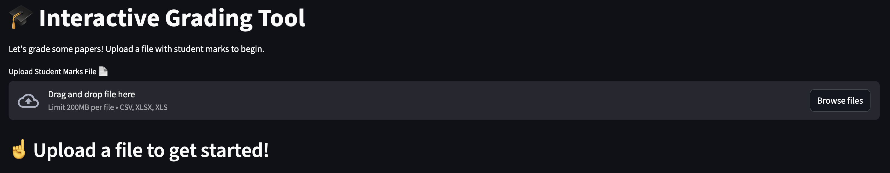
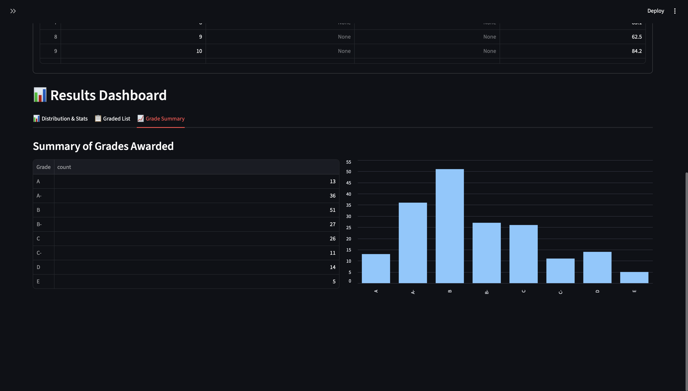

# 🎓 Interactive Grading Tool

An intuitive and powerful web application built with Streamlit designed to help educators, teachers, and instructors grade student marks, visualize complex distributions, and analyze class performance interactively. This tool moves beyond static spreadsheets by providing a dynamic interface to explore grading scenarios and gain deeper insights into student performance.The application is designed for anyone in an educational role who needs to translate numerical scores into grades efficiently. By automating the grading process and providing immediate visual feedback, it saves valuable time and helps in making more informed decisions about grade boundaries and overall class assessment.✨

### Link for deployed application : https://autogradingtool.streamlit.app/

## Features

### 🎯 Multiple Input Methods
* **File Upload:** Drag and drop or browse to upload CSV or Excel files (.csv, .xlsx, .xls)
* **URL Loading:** Load files directly from URLs (Google Sheets export links, Dropbox, OneDrive, etc.)
* **Sample Data:** Try the tool instantly with pre-loaded sample data (50 students)


### 🔒 Smart Data Validation
* **Automatic validation** of uploaded data for empty files, missing columns, and invalid marks
* **Warning system** for marks outside the 0-100 range
* **Error prevention** with clear, helpful error messages and troubleshooting tips

### ✅ Grade Boundary Validation
* **Real-time validation** ensures grade boundaries are in logical descending order (A > A- > B > B-, etc.)
* **Instant feedback** when boundaries are set incorrectly
* **Prevents grading errors** before they happen

* **Interactive Grade Boundaries:** Go beyond fixed grading scales. Use dynamic, high-precision sliders in the sidebar to set the exact minimum mark required for each letter grade (A, A-, B, B-, etc.). This feature is perfect for applying curves or testing different grading scenarios on the fly to see their immediate impact.


* **Instant Feedback Loop:** The entire dashboard is fully reactive. As you adjust a grade boundary slider, the histogram, summary statistics, and the final graded list all update in real-time. This eliminates guesswork and provides an immediate understanding of how your changes affect the final grade distribution.

* **Rich Data Visualization:**
    * **Marks Distribution Histogram:** A clear and informative histogram visualizes the frequency distribution of student marks. This chart is crucial for quickly identifying trends, such as clusters of high-achievers or students who are struggling. It is enhanced with vertical lines that dynamically update to show exactly where your grade cutoffs fall, providing powerful visual context.
    
    * **Grade Summary Chart:** A clean bar chart displays the total number of students who achieved each letter grade. This provides a high-level overview perfect for reports and understanding the overall class performance at a glance.
    
    
* **In-Depth Detailed Analysis:**
    * **Key Summary Statistics:** The dashboard presents crucial statistical metrics, including the mean (average score), median (the middle score), standard deviation (measure of score spread), highest/lowest marks, and total student count.
    * **Color-Coded Graded List:** A beautifully formatted, sortable table with color-coded grades for easy visualization (green for A/A-, blue for B/B-, yellow for C/C-, red for D/E/F).
    * **Pass/Fail Analytics:** Automatic calculation of pass rate and fail rate with visual metrics.
    * **Percentage Distribution:** View the percentage of students in each grade category.

    

### 💾 Export Functionality
* **Download Graded Results:** Export the complete graded student list as a CSV file
* **Multiple Download Points:** Download buttons in both the sidebar and the graded list tab
* **Ready for Record-Keeping:** Perfect for uploading to your LMS or keeping for your records

## 🛠️ How to Use
To run this application on your local machine, please follow these detailed steps. No prior web development experience is needed.

### Prerequisites
* Python 3.7 or higher: The core programming language this application is built on. If you don't have Python installed, you can download it from the official Python website.
* `pip` **(Python package installer):** This is the standard tool for installing Python packages and is included with most Python installations.

### 1. Clone the Repository
First, you need to get the project files onto your computer. You can do this by "cloning" the repository using Git, which is the recommended method if you want to stay updated.

```js
git clone https://github.com/shubham050802/Auto_Grading_Tool.git
cd Auto_Grading_Tool
```

Alternatively, if you are not familiar with Git, you can download the project as a ZIP file from the main repository page on GitHub and extract it.

### 2. Install Dependencies
This project relies on several external Python libraries. The `requirements.txt` file lists all of them. You can install them all with a single command:

```js
pip install -r requirements.txt
```

This command tells `pip` to read the file and install the specific versions of the libraries needed to run the application.

### 3. Run the Streamlit App
With the dependencies installed, you can now launch the application.

```js
streamlit run grading_tool.py
```

This command starts a local web server. Your default web browser will automatically open a new tab, and you will see the Interactive Grading Tool live and ready to use.

### 4. Using the Application

Once the app is running, you have three options to load data:

#### Option 1: Upload a File
1. Click on "📁 Upload File"
2. Drag and drop or browse to select your CSV or Excel file
3. The file will be loaded and validated automatically

#### Option 2: Load from URL
1. Click on "🔗 Load from URL"
2. Paste a link to your CSV or Excel file
3. The tool automatically handles Google Drive, Dropbox, and OneDrive URLs

**Supported Cloud Storage:**

📁 **Google Drive**
- Right-click file → Share → Get link
- Set to "Anyone with the link can view"
- Paste the entire URL (e.g., `https://drive.google.com/file/d/FILE_ID/view`)

📁 **Dropbox**
- Right-click file → Share → Create link
- Paste the link directly

📁 **OneDrive**
- Right-click file → Share → Copy link
- Paste the link directly

📁 **Direct URLs**
- Any publicly accessible CSV or Excel file URL
- GitHub: Use the "Raw" file URL

#### Option 3: Try Sample Data
1. Click on "🎯 Try Sample Data"
2. Instantly see the tool in action with 50 sample students
3. Experiment with grade boundaries to see real-time updates

After loading data:
- Adjust grade boundaries using the sliders in the sidebar
- View real-time updates in the histogram and statistics
- Export your graded results using the download buttons

### 📂 Project Files
* `Grading_tool.py`: The main Python script that contains all the application logic, from the user interface to the data processing and visualizations.
* `requirements.txt`: The dependency list. This file is crucial for ensuring the application runs correctly in any environment by specifying the necessary libraries.

### 📦 Dependencies
This project relies on the following powerful Python libraries:

* `streamlit`: The core framework used to build and run the interactive web application.
* `pandas`: The essential library for data manipulation and analysis; used here to read and process the uploaded CSV and Excel files.
* `numpy`: A fundamental package for numerical computation in Python, used for handling numerical data efficiently.
* `matplotlib`: A comprehensive library for creating static, animated, and interactive visualizations; used to generate the histogram and charts.
* `openpyxl`: A specialized library that allows pandas to read and write modern Excel (.xlsx) files.
* `requests`: HTTP library for loading files from URLs, enabling the URL input feature.
